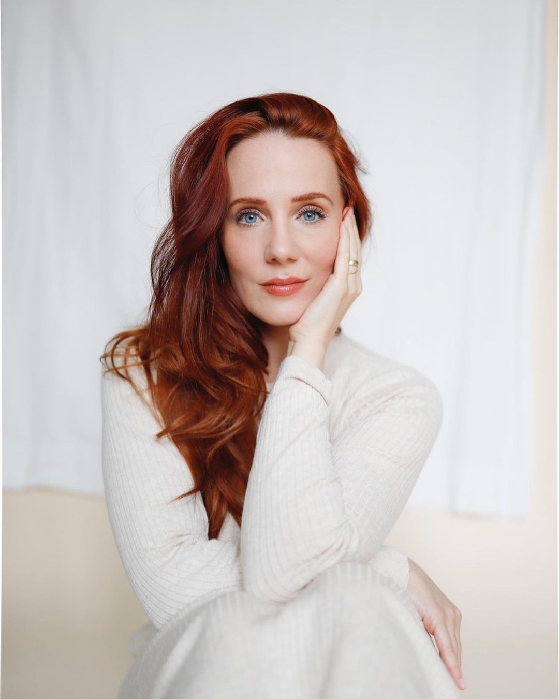
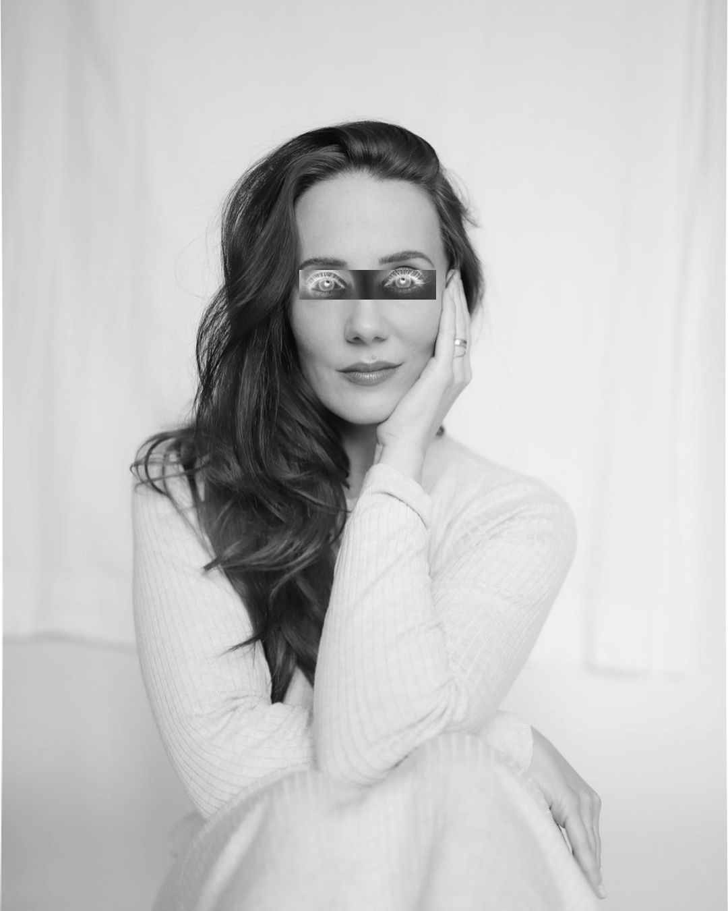
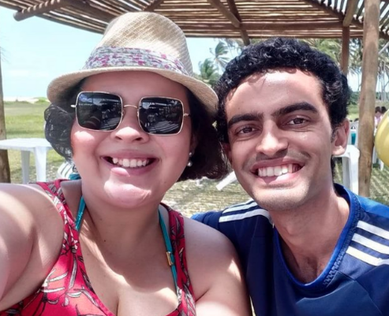
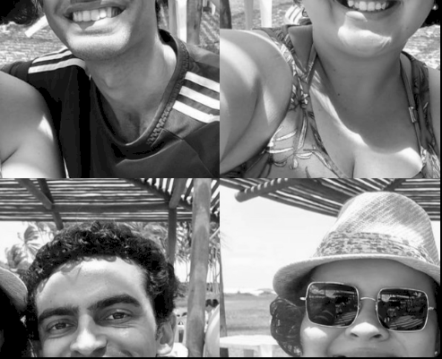
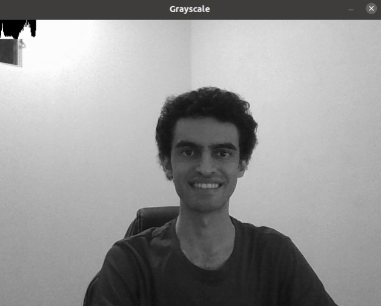
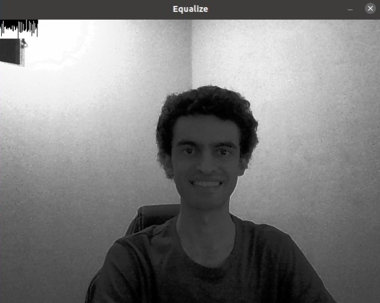

# Processamento Digital de Imagens com OpenCV

Esse artigo tem como objetivo implementar técnicas de Processamento Digital de Imagens aprendidas na disciplina de Processamento Digital Imagem do curso de Engenharia da Computação da UFRN.

## Exemplo 1
~~~c++
#include <iostream>
#include <opencv2/opencv.hpp>

using namespace cv;
using namespace std;

int main(int, char** argv){
  Mat image;
  Vec3b val;
  Point p1;
  Point p2;
  String file;
  
  image= imread(argv[1],IMREAD_GRAYSCALE);
  if(!image.data)
    cout << "nao abriu imagem" << std::endl;

  namedWindow("janela", WINDOW_AUTOSIZE);
  
  cout << "Digite as coordenadas de P1: " << endl;

  cin >> p1.x;
  cin >> p1.y; 

  cout << "Digite as coordenadas de P2: " << endl;
 
  cin >> p2.x;
  cin >> p2.y; 

  cout << "Digite o nome do arquivo: " << endl;

  cin >> file;
  
  for(int i=p1.y;i<p2.y;i++){
    for(int j=p1.x;j<p2.x;j++){
      image.at<uchar>(i,j)= 255 - image.at<uchar>(i,j);
    }
  }

  imshow("janela", image);

  imwrite(file + ".png",image);

  waitKey();
  
  return 0;
}

~~~

## Exemplo 2

~~~c++

#include <iostream>
#include <opencv2/opencv.hpp>

using namespace cv;
using namespace std;

int main(int, char** argv){
  Mat image, image1,image2,image3,image4,imageS;

  String file,file1,file2,file3,file4;
  int width=0,height=0;
  
  image= imread(argv[1],IMREAD_GRAYSCALE);
  if(!image.data)
    cout << "nao abriu imagem" << endl;

  namedWindow("janela", WINDOW_AUTOSIZE);

  width = image.cols;
  height = image.rows;

  imageS.create(height,width,CV_8U);
   
 
  image1 = image(Rect(0, 0, width/2, height/2));
  image2 = image(Rect(width/2, 0, width/2, height/2));
  image3 = image(Rect(0, height/2, width/2, height/2));
  image4 = image(Rect(width/2, height/2, width/2, height/2));
 
  cout << "Digite dos nome do arquivo: " << endl;

  cin >> file;
  cin >> file1;
  cin >> file2;
  cin >> file3;
  cin >> file4;
  

  imwrite(file1 + ".png",image1);
  imwrite(file2 + ".png",image2);
  imwrite(file3 + ".png",image3);
  imwrite(file4 + ".png",image4);
 

image4.copyTo(imageS(Rect(0, 0, width/2, height/2))); 

image3.copyTo(imageS(Rect(width/2-1,0, width/2, height/2))); 

image2.copyTo(imageS(Rect(0,height/2-1, width/2, height/2))); 

image1.copyTo(imageS(Rect(width/2-1,height/2-1, width/2, height/2))); 

  imshow("janela", imageS);

  imwrite(file + ".png",imageS);
  
  waitKey();
  
  return 0;
}
~~~

## Exemplo 4.1

~~~c++
#include <iostream>
#include <opencv2/opencv.hpp>

using namespace cv;
using namespace std;

int main(int argc, char** argv){
  Mat image;
  int width, height;
  VideoCapture cap;
  vector<Mat> planG; 
  vector<Mat> planE; 
  Mat histR, histE; 
  int nbins = 64; 
  float range[] = {0, 255};
  const float *histrange = { range };
  bool uniform = true; 
  bool acummulate = false;  
  int key;
  Mat gray; 
  Mat equa; 
  
  cap.open(0);

  if(!cap.isOpened()){
    std::cout << "cameras indisponiveis";
    return -1;
  }

  cap.set(cv::CAP_PROP_FRAME_WIDTH, 640); 
  cap.set(cv::CAP_PROP_FRAME_HEIGHT, 480);
  width = cap.get(cv::CAP_PROP_FRAME_WIDTH);
  height = cap.get(cv::CAP_PROP_FRAME_HEIGHT);

  cout << "largura = " << width << endl;
  cout << "altura  = " << height << endl;

  int histw = nbins, histh = nbins/2; 
  Mat histImgR(histh, histw, CV_8UC1, Scalar(0,0,0));
  Mat histImgE(histh, histw, CV_8UC1, Scalar(0,0,0));

  
  while(1){
    cap >> image;
    cvtColor(image, gray, COLOR_BGR2GRAY ); //converte grayscale
    split(gray, planG); 
  
    calcHist(&planG[0], 1, 0, Mat(), histR, 1,
                 &nbins, &histrange,
                 uniform, acummulate); 
                   
    normalize(histR, histR, 0, histImgR.rows, cv::NORM_MINMAX, -1, cv::Mat());
    
    histImgR.setTo(Scalar(0));
    
    for(int i=0; i<nbins; i++){
      line(histImgR,
               Point(i, histh),
               Point(i, histh-cvRound(histR.at<float>(i))),
               Scalar(255), 1, 8, 0);
      
    }
    
    histImgR.copyTo(gray(Rect(0, 0       ,nbins, histh)));
      
    imshow("Grayscale", gray);
     

    equalizeHist(gray, equa ); //equaliza
    split (equa, planE); 
    calcHist(&planE[0], 1, 0, Mat(), histE, 1,
                 &nbins, &histrange,
                 uniform, acummulate); 
                   
    normalize(histE, histE, 0, histImgE.rows, cv::NORM_MINMAX, -1, cv::Mat());
    
    histImgE.setTo(Scalar(0));
    
    for(int i=0; i<nbins; i++){
      line(histImgE,
               Point(i, histh),
               Point(i, histh-cvRound(histE.at<float>(i))),
               Scalar(255), 1, 8, 0);
      
    }
    
    histImgE.copyTo(equa(Rect(0, 0       ,nbins, histh)));
       
    imshow("Equalize",equa);
  
    key = cv::waitKey(30);
    if(key == 27) break;

 }

  return 0;
}

~~~

## Exemplo 4.2

~~~c++

#include <iostream>
#include <opencv2/opencv.hpp>

using namespace cv;
using namespace std;

int main(int argc, char** argv){ 
  Mat image, image2;
  int width, height;
  VideoCapture cap;
  vector<Mat> planes, planes2; 
  Mat histR, histR2;
  int nbins = 64; 
  float range[] = {0, 255}; 
  const float *histrange = { range }; 
  bool uniform = true;  
  bool acummulate = false;  
  int key;

	cap.open(0); 

  if(!cap.isOpened()){
    cout << "cameras indisponiveis";
    return -1;
  }

  cap.set(CAP_PROP_FRAME_WIDTH, 640); 
  cap.set(CAP_PROP_FRAME_HEIGHT, 480);
  width = cap.get(CAP_PROP_FRAME_WIDTH);
  height = cap.get(CAP_PROP_FRAME_HEIGHT);

  cout << "largura = " << width << endl;
  cout << "altura  = " << height << endl;

  int histw = nbins, histh = nbins/2; 
  Mat histImgR(histh, histw, CV_8UC3, Scalar(0,0,0)); 
  Mat histImgR2(histh, histw, CV_8UC3, Scalar(0,0,0));
  

  while(1){
    cap >> image;
    split (image, planes2); 
    calcHist(&planes2[0], 1, 0, Mat(), histR, 1,
                 &nbins, &histrange,
                 uniform, acummulate); 
              

    normalize(histR, histR, 0, histImgR.rows, NORM_MINMAX, -1, Mat());
    

    histImgR.setTo(Scalar(0)); 
       

    for(int i=0; i<nbins; i++){
      line(histImgR,
               Point(i, histh),
               Point(i, histh-cvRound(histR.at<float>(i))),
               Scalar(0, 0, 255), 1, 8, 0);
            
      
    }
    histImgR.copyTo(image(Rect(0, 0       ,nbins, histh)));

    cap >> image2;
    split (image2, planes); 

    calcHist(&planes[0], 1, 0, Mat(), histR2, 1,
                 &nbins, &histrange,
                 uniform, acummulate); 

    normalize(histR2, histR2, 0, histImgR2.rows, NORM_MINMAX, -1, Mat());

    histImgR2.setTo(Scalar(0)); 
    
 for(int i=0; i<nbins; i++){
      
      line(histImgR2,
               Point(i, histh),
               Point(i, histh-cvRound(histR2.at<float>(i))),
               Scalar(0, 0, 255), 1, 8, 0);        
      
    }
   histImgR2.copyTo(image(Rect(0, 2*histh   ,nbins, histh)));

    double comp = compareHist(histR,histR2,0);

    cout << comp << endl;

    if(comp<0.996500){
      putText(image, "Motion Detected", Point(image.cols/2 - 50, 40), FONT_HERSHEY_COMPLEX_SMALL, 1, Scalar(0, 0, 255), 2);
    }

    imshow("image", image);
    key = waitKey(30);
    if(key == 27) break;
  }
  return 0;
}
~~~

